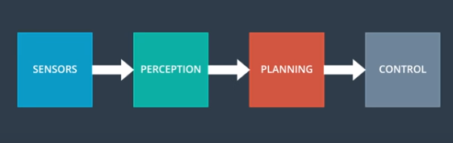
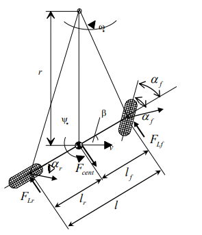
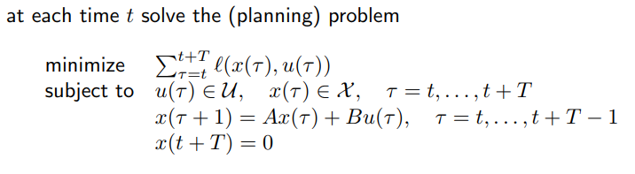
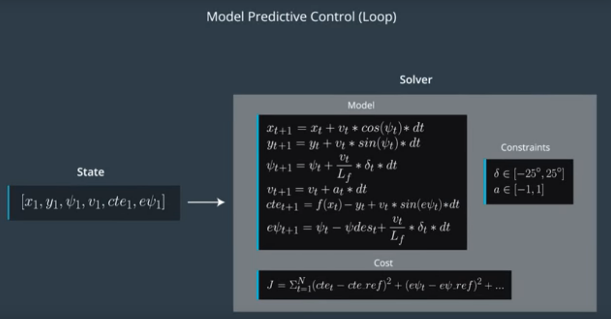

## New Updates
<p align="center">
     
     <br>MPCDEMO.gif
</p>
The vehicle can now drive up to 100mph in the test track. I made the following changes:

# Moving Average Filter
I used a 5 step moving average to smooth out the acceleration reading, instead of directly getting it from the WebSocket. This will improve the performance under some fast accel/deccel situations. I added a timestamp function and deque/sliding window array to create this moving average filter.  

# Dynamic Reference Velocity
Now the reference should be a range instead of a fixed value. The reference speed will drop if the incoming waypoints/turning angle is big. The following function added into the MPC class, to change the global variable ref_v based on accumulated turning angle for the next waypoints, and the function is called in the main loop. When tuning the velocity, we turn the range [vxmin,vxmax].
```cpp
void MPC::VelTune(const VectorXd &xvals, const VectorXd &yvals){
  double turnAngle = 0;
  for(int i = 1; i<xvals.size();++i){
    turnAngle += fabs(atan2(yvals[i] - yvals[i-1] , xvals[i] - xvals[i-1]));
  }
  turnAngle /= xvals.size(); // average turning angle for each step
  const double turnMax = 0.6, turnMin = 0.1; // the max and min turn for each step
  turnAngle = max(min(turnAngle, turnMax), turnMin); // satuation
  // vx_max - vx_min is a decceleration range, normally ~30,40
  ref_v = vx_max - ((vx_max - vx_min) * turnAngle / turnMax); // higher turn angle, lower speed
  //cout<< "The speed ref: " << ref_v << endl;
  ref_v = max(min(ref_v, vx_max), vx_min);
}
```
# matplotlibcpp
<p align="center">
     
     <br>MATPLOT.png
</p>
I added some matplot functions to draw the map and vehicle performance, and this is very helpful when tuning the controller. The map drawing function is the cViz.h file, and the plot data is saved in a vector<double> array, and it caches the data when the main function is running. I set it to stop after 300 loop iteration, feel free to change the information you want to plot and the iteration numbers. Here is the instruction on how to use it:

It may be neccesary to install additional dependencies, especially for Docker and Ubuntu BASH on Windows hosts.  A complete list of dependencies can be found [here](https://github.com/udacity/CarND-MPC-Quizzes/blob/master/Dockerfile).  The mind the line solution uses a matplotlib inspired plotting cpp plotting library, which depends on python components.  To enable plotting, most Windows users will need to execute the following commands **note for dockers users, leave out ```sudo```):
- ```sudo apt-get update```
- ```sudo apt-get install python-matplotlib```
- ```sudo apt-get install python2.7-dev```

In addition, to display plots, an X-server must be running on the host and accessible.  To accomplish this in Ubuntu BASH for windows, do the following:
- [Download and install Xming](https://sourceforge.net/projects/xming/?source=typ_redirect)
- Start Xming
- execute the following in the terminal: ```export DISPLAY=:0```
- run the code from the build folder ```./mpc```

Some guides about the matplotlibcpp: [matplotlib wrapper](https://github.com/lava/matplotlib-cpp) could be helpful.)

# Some Tuning Tips (More time spent = better tuning )
Use a configuration file to change the setting would help, so that you don't have to recompile it every time(create a vehicle/configuration class, and link/read the parameters to a txt/JSON file).
I tried 25 prediction horizon. It works really good under slow speed situation. However, it tends to react too early when facing a curved road. When I reduce it to 15 prediction horizon, it works fine with a reference speed about 100mph. 
To make the vehicle go faster, we need to lose up a bit on the tracking error, to make the car have some space to oscillate after a big turn. But we can not make to swing too much, which means we should increase the steering actuation and change of steering actuation weight to make the yaw transition smoother. Since the speed is high, it requires more aggressive yaw control, and we should increase the yaw error weight as well. 
Plus, this additional cost function really helps: 
```cpp
              fg[0] += 300*CppAD::pow(vars[delta_start + t] * vars[v_start + t], 2);
```
It penalizes the vehicle for speeding and steering the same time, which prevent it from oscillating too much during/after a big curve.
If the vehicle hits the road curb often, maybe the speed weight is too high, the car is trying too hard to catch up the speed.

## Reflection
The control module is a very important stage of the AD pipeline. In this project, the inputs states are retrieved from the outputs of the path planning module in the form of waypoints sets. The objective of the controller is to track the path plan as a reference as close as possible, using two actuator commands (steering angle and throttle) within a certain physical constraints. This particular control problem is framed into an optimization problem with the help of MPC, and the output commands cost functions are solved by the Ipopt Nonlinear Programming Solver.

<p align="center">
     
     <br>Pipeline.PNG
</p>

# Vehicle Model
An classic Bicycle Model is use here to deliver the vehicle dynamic of each time instance:
<p align="center">
     
     <br>Model.PNG
</p>
The local coordinates/states are updated through the following dynamics:

```cpp
          px[t+dt] = px[t] + v[t] * cos(psi[t]) * dt;
          py[t+dt] = py[dt] + v[t] * sin(psi[t]) * dt;
          psi[t+dt] = psi[t] - v[t] * delta[t] / Lf * dt;
          v[t+dt] = v[t] + a[t] * dt;
          cte[t+dt] = cte[t] + v[t] * sin(epsi[t]) * dt;
          epsi[t+dt] = epsi[t]+ v[t] * delta[t] / Lf * dt;
```
Where px,py is the vehicle position and psi is the heading orientation. The velocity v is updated with the throttle(accel) a. The sampling time is selected as 100ms for this project.
<p align="center">
     
     <br>dynamic local.png
</p>

The error feedbacks are updated through the following equations: 
```cpp
          cte[t+dt] = cte[t] + v[t] * sin(epsi[t]) * dt;
          epsi[t+dt] = epsi[t]+ v[t] * delta[t] / Lf * dt;
```
Where cte is the cross track error, which corresponds to distance of vehicle from the planned trajectory. The epsi is the is the angle difference of the vehicle trajectory with the planned trajector. 
<p align="center">
     
     <br>dynamic map.png
</p>

# Cost Functions and MPC Tuning 
The cost function part is similar to a classic convex optimal control problem:
<p align="center">
     
     <br>CF.PNG
</p>
Based on the objectives, the cost function get penalized everytime:
* cte and epsi increase - to ensure steady state error
* high usage of control effort - to minimize the use of actuators
* high change rate of control effort - to ensure smooth drive 

The weight for each penalty is defined based on the importance of the states. Refference tracking is set to the highest priority, then smoothness is very important as well to damp the overshoot of the response. 

For the rest of states feed into the CppAD are served as a regulator which had the constraints set to zero. They will be updated with the new control outputs each loop to solve for the cost function. 
<p align="center">
     
     <br>solver_in.png
</p>

# Prediction Horizon and Latency Effects
The prediction horizon is selected as 10 steps with a sampling time of 100ms. The control horizon is not specified (can be improved since we working with a simulator and the response is fairly fast). Some trade-off were made to ensure the visibility of the prediction and also limited the computation cost.
The states are updated for an interval of 100ms before feeding into the solver, to compensate the latancy effects(if introduced).

# CarND-Controls-MPC
Self-Driving Car Engineer Nanodegree Program

---

## Dependencies

* cmake >= 3.5
 * All OSes: [click here for installation instructions](https://cmake.org/install/)
* make >= 4.1(mac, linux), 3.81(Windows)
  * Linux: make is installed by default on most Linux distros
  * Mac: [install Xcode command line tools to get make](https://developer.apple.com/xcode/features/)
  * Windows: [Click here for installation instructions](http://gnuwin32.sourceforge.net/packages/make.htm)
* gcc/g++ >= 5.4
  * Linux: gcc / g++ is installed by default on most Linux distros
  * Mac: same deal as make - [install Xcode command line tools]((https://developer.apple.com/xcode/features/)
  * Windows: recommend using [MinGW](http://www.mingw.org/)
* [uWebSockets](https://github.com/uWebSockets/uWebSockets)
  * Run either `install-mac.sh` or `install-ubuntu.sh`.
  * If you install from source, checkout to commit `e94b6e1`, i.e.
    ```
    git clone https://github.com/uWebSockets/uWebSockets
    cd uWebSockets
    git checkout e94b6e1
    ```
    Some function signatures have changed in v0.14.x. See [this PR](https://github.com/udacity/CarND-MPC-Project/pull/3) for more details.

* **Ipopt and CppAD:** Please refer to [this document](https://github.com/udacity/CarND-MPC-Project/blob/master/install_Ipopt_CppAD.md) for installation instructions.
* [Eigen](http://eigen.tuxfamily.org/index.php?title=Main_Page). This is already part of the repo so you shouldn't have to worry about it.
* Simulator. You can download these from the [releases tab](https://github.com/udacity/self-driving-car-sim/releases).
* Not a dependency but read the [DATA.md](./DATA.md) for a description of the data sent back from the simulator.


## Basic Build Instructions

1. Clone this repo.
2. Make a build directory: `mkdir build && cd build`
3. Compile: `cmake .. && make`
4. Run it: `./mpc`.

## Build with Docker-Compose
The docker-compose can run the project into a container
and exposes the port required by the simulator to run.

1. Clone this repo.
2. Build image: `docker-compose build`
3. Run Container: `docker-compose up`
4. On code changes repeat steps 2 and 3.

## Tips

1. The MPC is recommended to be tested on examples to see if implementation behaves as desired. One possible example
is the vehicle offset of a straight line (reference). If the MPC implementation is correct, it tracks the reference line after some timesteps(not too many).
2. The `lake_track_waypoints.csv` file has waypoints of the lake track. This could fit polynomials and points and see of how well your model tracks curve. NOTE: This file might be not completely in sync with the simulator so your solution should NOT depend on it.
3. For visualization this C++ [matplotlib wrapper](https://github.com/lava/matplotlib-cpp) could be helpful.)
4.  Tips for setting up your environment are available [here](https://classroom.udacity.com/nanodegrees/nd013/parts/40f38239-66b6-46ec-ae68-03afd8a601c8/modules/0949fca6-b379-42af-a919-ee50aa304e6a/lessons/f758c44c-5e40-4e01-93b5-1a82aa4e044f/concepts/23d376c7-0195-4276-bdf0-e02f1f3c665d)
